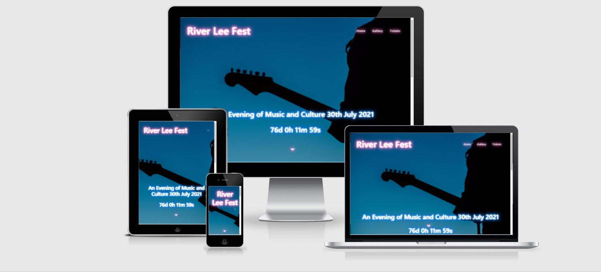

# Culture Night (River Lee Fest)

[View the Live website here](https://jaydavis359.github.io/MS2-Culture-Night/index.html)

### Culture Night is a fictional Offical website for the River Lee Festival in Cork City.

The website is a first point of contact for anyone who is looking for information about the fesival.
The website contains a landing page with a google maps interface showing locations of various activities on the night, it also has a gallery page with a small selection of photos of the events.
The website also has a booking page where the user can request free tickets for the event by way of an email form.

## UX

### This website is for :

* Visitors to the website are looking for information about the festival and the location of the events.
* Hosting this website allows a branch of communication to those interested in the festival, who may not otherwise hear about it through print media, or radio.

### User Stories

* As a visitor to the website, I want the navagation to be instantly Understandable.
* As a visiter to the website, I want to learn more about the festivals events.
* As a visitor to the website, I want to view a map of its various locations.
* As a visitor to the website, I want to be offered sign up options, to be kept up to date with this event and future events.
* As a visitor to the website, I want to be able to book tickets for the event from the website.
* As a visitor to the website, I want the option to follow the event on social media.

### Wireframes

* [Wireframes](Wireframes/Culture Night.bmpr)

## Features

The website is designed to be aesthetically pleasing while having full featured navagation options, the vibrant color palate and fonts which extend across
the whole site, allow for easy viewing of the different elements.

### Home Page

* The home page features a responsive navagation bar with links to the other two pages.
* It features an almost fullscreen hero image of the author, which lets the visitor know they
are in exactly the right place .
* When the page is scrolled down the home screen features an 'about' paragraph which introduces the festival.
* Next, a Google Map appears, using the [google maps API](https://developers.google.com/maps) with markers which when clicked display the event in that location.
* Finally the footer of the page contains an email sign up with submit button for those interested in being kept up to date with news and events, in addition to this
there are social media icons which direct to the external websites.

### Gallery Page

* Navagation bar as before.
* A gallery type section is the focus of this page, the images show outdoor scenes from previous events.
* Footer as before.

### Booking Page 

* Navagation bar as before.
* Form section where visitors can request tickets for the event by email, this information is then forwarded using [email.js](https://www.emailjs.com/) to an email client.

## Features Left to Implement

* More media content in the form of videos of past events, interviews with artists, and also podcast / radio links.
* The option to change the written language of the page for non english speaking visitors.
* Quciker loading times for the various media elements.

## Technologies Used

The website is built using HTML and CSS programming languages.

* [Gitpod](https://gitpod.io/) - Developer environment was used to write the code.
* [Github](https://github.com/) - Used to host and deploy the code.
* [Bootstrap 4](https://getbootstrap.com/) - Used primarily for its responsive grid sysyem layout, also bootstrap components documentation for Navagation,
the 'card' components on the works page, and some of the forms details.
* [Google Fonts](https://fonts.google.com/) - Used for the websites various fonts.
* [Font Awsome](https://fontawesome.com/) - The Font Awesome library was used for the icons the website.
* [favicon.io](favicon.io) - Was used to create the favicon for the browser tab.
* [TinyJPG](https://tinyjpg.com/) - Used to compress the websites images.
* [Eye Dropper](https://chrome.google.com/webstore/detail/eye-dropper/hmdcmlfkchdmnmnmheododdhjedfccka?hl=en) Chrome extension, which I used to select my color palate.

## Testing

Details can be found on a separate [Testing](Testing.md) page.

## Deployment

This Website was developed using Gitpod, commited using git, and pushed to Github via the terminal function. 

To deploy this website to GitHub pages from its repository the following actions were taken:

* Log into Github
* From the list of repositorys displayed, select jaydavis359/MS1-Kazuo-Ishiguro.
* On the next screen select the settings tab on the right side of the menu.
* Scroll down this page until you reach the GitHub Pages Section.
* Click on the highlighted links which will take you to the new GitHub pages dedicated tab.
* Under the 'Source' Section of this page select the option currently labelled 'none' and change it to 'master branch'.
* On complection of this action the page will be refreshed and the website will be deployed.
* The link to the website will now be displayed in the Github Pages section of the settings menu.

To run the Website locally :

* It can be 'Forked' which makes an editable copy of the repository, without affecting the original. This can be done from the [repository homepage](https://github.com/jaydavis359/MS2-Culture-Night),
In the top right of the page there is a 'Fork' button which will create a copy of the repository in your own GitHub account.
  
* It can also be 'Cloned' which creates a 'remote' repository which can be synced with the main one. To do this:
> open the [repository homepage](https://github.com/jaydavis359/MS2-Culture-Night)
> Click on the 'Code' button near the top right of the screen.
> Under 'Clone' with the HTTPS option selected, copy the url link.
> Open your own IDE and switch to the directory where you want the cloned directory.
> Type 'git clone', and then paste the URL you copied earlier.
> Press enter and the repository will be cloned.

## Credits

* [Bootstrap](https://getbootstrap.com/) components documentation was used for several elements.
* [Academind](https://www.youtube.com/channel/UCSJbGtTlrDami-tDGPUV9-w) YouTube channel for help with code and execution
of the navbar collapse function.
* [W3Schools](https://www.w3schools.com/) and [Stack Overflow](https://stackoverflow.com/) for code and formatting issues.
* [Traversy](https://www.youtube.com/user/TechGuyWeb) Youtube Channel for help with javascript.

### Images:

* All images for the project were taken from the royalty free websites [pexels](pexels.com) and [unsplash](unsplash.com).

### Acknowledgements

* I would like to thank my mentor Excellence Ilesanmi for his help and patience.

### This website is for educational purposes only.